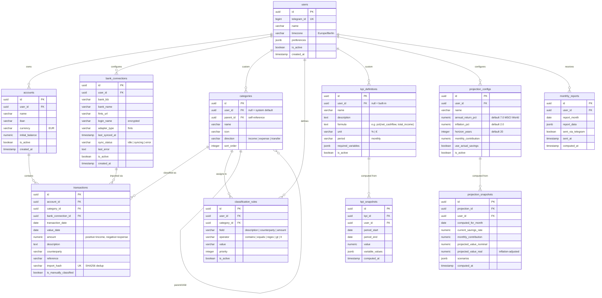
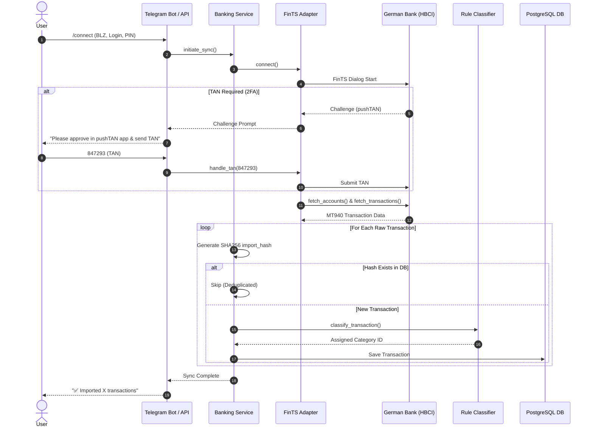
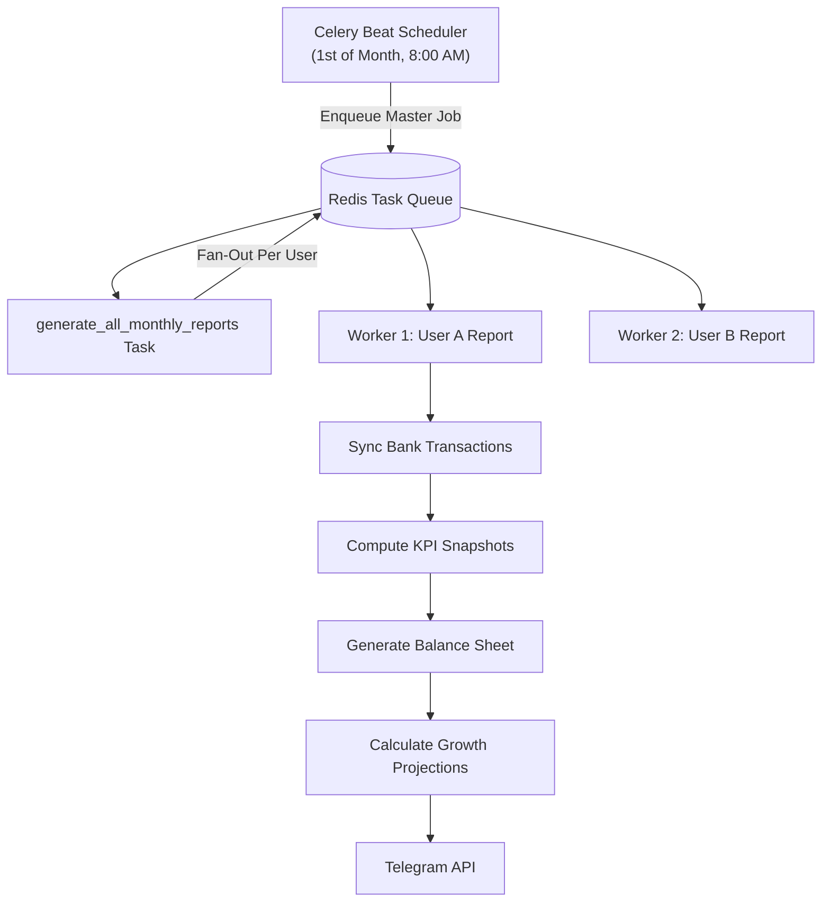

# 📐 SavingsTracker — Architecture Specification

This document details the software design, database ER schema, data flow pipelines, and security architecture of SavingsTracker.

---

## 🏢 System Design & Layers

SavingsTracker is structured as a **modular domain-driven application** in Python 3.12. Each domain module (`accounts`, `banking`, `transactions`, `classification`, `kpis`, `projections`, `balance_sheets`, `users`, `scheduler`) encapsulates its own models, Pydantic schemas, business services, and API routers.

```
src/
├── core/                # Shared DB session, caching, security, base models
├── users/               # User identification & Telegram mapping
├── accounts/            # Bank account balance tracking
├── banking/             # FinTS/HBCI adapters & sync pipelines
├── transactions/        # Transaction storage, deduplication, filtering
├── classification/      # Category taxonomy & pattern-matching rule engine
├── kpis/                # Safe asteval formula evaluation & snapshot storage
├── projections/         # Compound interest growth math & scenario analysis
├── balance_sheets/      # Income vs Expense statement formatting
├── scheduler/           # Celery async tasks & monthly report builder
└── telegram_bot/        # python-telegram-bot conversational handlers
```

---

## 🗄️ Database ER Diagram



---

## 🔗 Bank Sync & Deduplication Pipeline



---

## ⏰ Monthly Async Task Pipeline (Celery)



---

## 🔒 Security Architecture

1. **At-Rest Encryption**: Sensitive bank login names and tokens are encrypted using **Fernet (AES-128 in CBC mode with HMAC)** before being written to PostgreSQL.
2. **Ephemeral PIN Handling**: Banking PINs are passed in-memory during sync calls and are never stored in the database. When entered via Telegram, the bot deletes the PIN message immediately.
3. **Safe Formula Parsing**: User-defined KPI formulas are evaluated using AST parsing (`asteval`), completely isolated from system builtins, standard library functions, or shell execution.
4. **Rate Limiting**: Bank sync operations are restricted to **1 sync per hour per connection** via Redis sliding window rate-limiters to prevent account locks or API spam.
