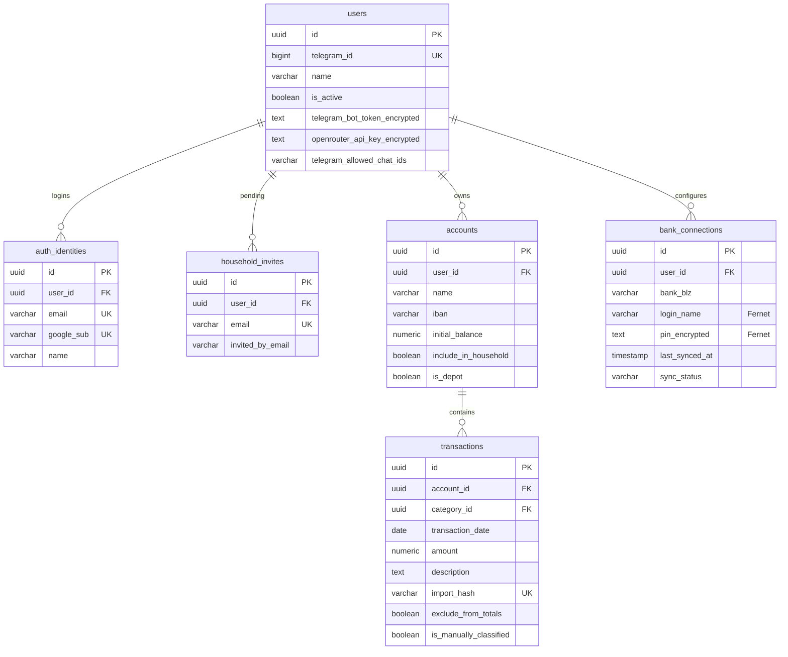
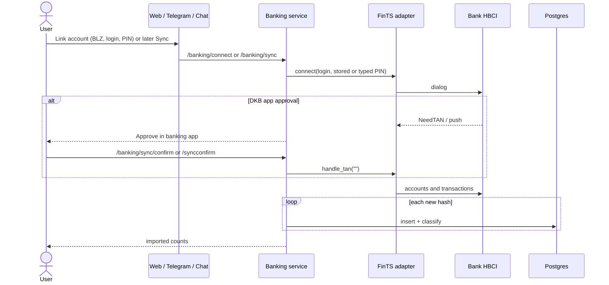

# SavingsTracker — architecture

How the running app is structured: domains, data model, bank sync, and security.

---

## Layout

A household is one `users` row. Google accounts attach via `auth_identities`. Partners join with an invite, not a second household.

```
src/
├── core/             # Engine, sessions, Fernet, Redis helpers
├── auth/             # Google OAuth, session, invites, admin household wipe
├── users/            # Household row, Telegram link, per-household secrets
├── accounts/         # Giro / depot flags, household inclusion
├── banking/          # FinTS connect, stored PIN, Sync / confirm
├── transactions/     # Import hash, classify, exclude
├── classification/   # Categories and rules
├── kpis/             # Formulas and snapshots
├── projections/      # Compound growth
├── balance_sheets/   # Period income vs expense
├── llm/              # OpenRouter tool loop (web chat + Telegram)
├── scheduler/        # Celery monthly digest and stale-connection check
└── telegram_bot/     # Polling, pairing codes, /sync

frontend/             # Vite React SPA, copied into the image as frontend/dist
```

FastAPI serves `/api/*` behind a session cookie, then the SPA for everything else. Production compose puts the app on Traefik (`proxy` network) with no host port for 8000.

---

## Auth and tenancy

1. `GET /login` redirects to Google. Callback stores `{user_id, email, name, picture}` in a signed cookie.
2. First identity on an empty-identity, single-user database **claims** that existing household (legacy data).
3. Later new Google emails create a **new** household unless they have a pending invite.
4. `ALLOWED_EMAILS` gates new signups; invites bypass it.
5. `ADMIN_EMAILS` can `GET/DELETE /api/admin/households/{id}` (not their own).
6. Every `/api` route except `/api/health` (and the login pages) requires `get_current_user`. Path `user_id` must match the session household.

---

## Database

Postgres in Docker uses named volume `pgdata`. Restarts keep data; `docker compose down -v` does not.


```mermaid
erDiagram
    users {
        uuid id PK
        bigint telegram_id UK
        varchar name
        boolean is_active
        text telegram_bot_token_encrypted
        text openrouter_api_key_encrypted
        varchar telegram_allowed_chat_ids
    }

    auth_identities {
        uuid id PK
        uuid user_id FK
        varchar email UK
        varchar google_sub UK
        varchar name
    }

    household_invites {
        uuid id PK
        uuid user_id FK
        varchar email UK
        varchar invited_by_email
    }

    accounts {
        uuid id PK
        uuid user_id FK
        varchar name
        varchar iban
        numeric initial_balance
        boolean include_in_household
        boolean is_depot
    }

    bank_connections {
        uuid id PK
        uuid user_id FK
        varchar bank_blz
        varchar login_name "Fernet"
        text pin_encrypted "Fernet"
        timestamp last_synced_at
        varchar sync_status
    }

    transactions {
        uuid id PK
        uuid account_id FK
        uuid category_id FK
        date transaction_date
        numeric amount
        text description
        varchar import_hash UK
        boolean exclude_from_totals
        boolean is_manually_classified
    }

    users ||--o{ auth_identities : "logins"
    users ||--o{ household_invites : "pending"
    users ||--o{ accounts : "owns"
    users ||--o{ bank_connections : "configures"
    accounts ||--o{ transactions : "contains"
```

Also present (same as before): `categories`, `classification_rules`, `kpi_definitions`, `kpi_snapshots`, `projection_configs`, `projection_snapshots`, `monthly_reports`.

`ensure_schema()` adds columns on existing DBs when compose skips Alembic (production image runs `python -m src.main`). Local compose can run `alembic upgrade head`.

---

## Bank sync


```mermaid
sequenceDiagram
    actor User
    participant UI as Web / Telegram / Chat
    participant API as Banking service
    participant FinTS as FinTS adapter
    participant Bank as Bank HBCI
    participant DB as Postgres

    User->>UI: Link account (BLZ, login, PIN) or later Sync
    UI->>API: /banking/connect or /banking/sync
    API->>FinTS: connect(login, stored or typed PIN)
    FinTS->>Bank: dialog
    alt DKB app approval
        Bank-->>FinTS: NeedTAN / push
        API-->>User: Approve in banking app
        User->>API: /banking/sync/confirm or /syncconfirm
        API->>FinTS: handle_tan("")
    end
    FinTS->>Bank: accounts and transactions
    loop each new hash
        API->>DB: insert + classify
    end
    API-->>User: imported counts
```

- First **Link account** stores encrypted login + PIN on `bank_connections`.
- Later **Sync** (`POST /api/banking/sync`) uses that PIN. Rate limit: one successful start per connection per hour.
- Telegram `/sync` and the LLM `sync_bank` tool call the same `start_household_sync` / `confirm_household_sync` helpers.

---

## Monthly jobs (Celery Beat)

Timezone `Europe/Berlin`.

| Job | When | Task |
|:--|:--|:--|
| Monthly reports | 1st, 08:00 | `generate_all_monthly_reports` → per-household Telegram digest |
| Stale connections | Daily 06:00 | Mark bank links idle > 30 days |

Beat schedule entries must not include a `description` key (Celery 5.6 `ScheduleEntry` rejects it).

---

## Security

1. **Google session** — HMAC-signed cookie (`AUTH_SECRET_KEY`), `Secure` when `PUBLIC_BASE_URL` is HTTPS, `SameSite=lax`.
2. **At rest** — Fernet (`ENCRYPTION_KEY`) for bank login, PIN, Telegram bot token, OpenRouter key.
3. **PIN** — stored encrypted after a successful web link so Sync/chat/`/sync` can run without typing it again. Not logged.
4. **KPI formulas** — `asteval` only; no `eval()`.
5. **FinTS** — registered `FINTS_PRODUCT_ID`; DKB rejects generic IDs. Sync rate-limited in Redis.
6. **Telegram** — pairing codes from Settings; group access via `TELEGRAM_ALLOWED_CHAT_IDS`.
7. **Admin wipe** — email allowlist; deletes identities, invites, and household rows (not your own).

---

## Frontend

React SPA in `frontend/`. Production build is copied into the API image. Dev server (`npm run dev`) proxies API and OAuth paths to port 8000. Session requests use `credentials: "include"`.
