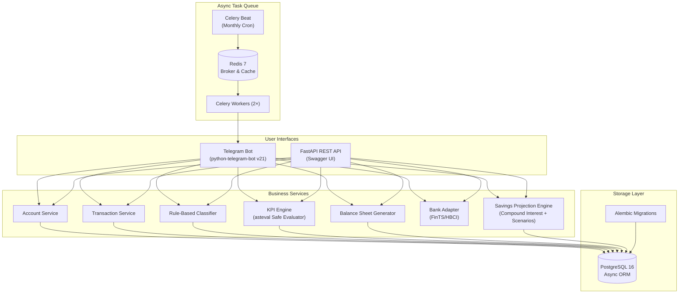

# 💰 SavingsTracker

A modular, self-hosted personal finance application built to automatically connect to bank accounts, classify transactions using customizable rules, generate periodic balance sheets, surface **user-definable KPI formulas**, and project **long-term compound growth** (with MSCI World benchmarking and scenario analysis).

Delivers automated monthly financial digests via a **Telegram chatbot** and a **FastAPI REST API**.

---

## 🌟 Key Features

*   **🏦 Automated Bank Connections**: Integrates directly with German bank accounts via FinTS/HBCI (`python-fints`) with 2FA/TAN challenge support. Features pluggable adapter architecture for future Open Banking providers.
*   **🏷️ Smart Transaction Classification**: Priority-ordered rule engine supporting `contains`, `equals`, `regex`, `gt`, and `lt` operators across descriptions, counterparties, and amounts.
*   **📊 User-Definable KPI Formula Engine**: Write custom financial metrics using pythonic math expressions (e.g. `pct(net_cashflow, total_income)`) evaluated safely via `asteval` (no unsafe `eval()`).
*   **🔮 Compound Growth & Scenario Projections**: Calculates 20-year portfolio projections (nominal and inflation-adjusted real values). Automatically evaluates 5 "what-if" scenarios (±5%, ±10% savings rate) showing exact long-term €€€ impacts.
*   **⏰ Automated Monthly Digest**: Celery task queue with Celery Beat scheduler automatically compiles monthly balance sheets, KPI trends, and projection updates, delivering markdown reports to Telegram on the 1st of each month.
*   **🐳 Scalable Architecture**: Fully containerized with Docker Compose (PostgreSQL 16, Redis 7, FastAPI, 2× Celery Workers, Celery Beat). Connection pooling tuned for hundreds of users.

---

## 🏗️ High-Level Architecture



For detailed component interactions and ER diagrams, see [ARCHITECTURE.md](./ARCHITECTURE.md).

---

## 🛠️ Technology Stack

| Layer | Technology | Purpose |
|:--|:--|:--|
| **Language** | Python 3.12+ | Core language |
| **Web API** | FastAPI + Uvicorn | Async REST endpoints & Swagger docs |
| **ORM & DB** | SQLAlchemy 2.0 (async) + asyncpg + PostgreSQL 16 | Data persistence & connection pooling |
| **Task Queue** | Celery 5 + Redis 7 | Async background tasks & periodic cron scheduling |
| **Telegram Bot** | python-telegram-bot v21 | Conversational chat interface |
| **Bank Protocol** | python-fints | FinTS/HBCI integration for German banks |
| **KPI Engine** | asteval | AST-based safe formula evaluation |
| **Containerisation** | Docker & Docker Compose | Container orchestration |

---

## 🚀 Quick Start (Docker Deployment)

### 1. Prerequisites
- Docker Engine & Docker Compose installed
- A Telegram bot token (from [@BotFather](https://t.me/BotFather))

### 2. Configuration
Copy `.env.example` to `.env` and fill in your secrets:

```bash
cp .env.example .env
```

Generate a secure encryption key for bank credentials:
```bash
python3 -c "from cryptography.fernet import Fernet; print(Fernet.generate_key().decode())"
```

Edit `.env`:
```ini
DATABASE_URL=postgresql+asyncpg://savingstracker:changeme@db:5432/savingstracker
DB_PASSWORD=changeme
REDIS_URL=redis://redis:6379/0
TELEGRAM_BOT_TOKEN=123456789:ABCdefGhIJKlmNoPQRsTUVwxyZ
ENCRYPTION_KEY=your-generated-fernet-key
FINTS_PRODUCT_ID=your-fints-product-id
```

### 3. Launch Services
```bash
docker compose up -d --build
```

This starts:
- **`db`**: PostgreSQL 16 on port `5432`
- **`redis`**: Redis 7 on port `6379`
- **`app`**: FastAPI API + Telegram Bot polling loop on port `8000`
- **`worker`**: 2× Celery background task workers
- **`beat`**: 1× Celery Beat periodic scheduler

### 4. Verify Installation
- **Interactive API Documentation**: Open `http://localhost:8000/docs`
- **Telegram Bot**: Send `/start` to your bot in Telegram!

---

## 🤖 Telegram Bot Commands

| Command | Description |
|:--|:--|
| `/start` | Welcome message & automatic user registration |
| `/help` | Detailed command manual |
| `/accounts` | List linked accounts & balances |
| `/connect` | Link German bank account via FinTS/HBCI |
| `/kpis` | Live KPI dashboard & savings rate for the current month |
| `/newkpi` | Define a custom KPI metric with a mathematical formula |
| `/projection` | 20-year compound growth projection (MSCI World) & scenario analysis |
| `/balance` | Current month's balance sheet (Income vs. Expenses) |

---

## 📐 KPI Formula Engine

Users can create arbitrary financial metrics using standard mathematical syntax.

### Example Formulas:
- **Savings Rate**: `pct(net_cashflow, total_income)`
- **Dining Out Share**: `pct(category_dining_out_total, total_expense)`
- **Daily Burn Rate**: `total_expense / days_in_period`
- **Custom Leisure Share**: `pct(category_dining_out_total + category_entertainment_total, total_expense)`

### Available Variables:
`total_income`, `total_expense`, `net_cashflow`, `tx_count`, `avg_expense`, `max_expense`, `days_in_period`, `prev_total_income`, `prev_total_expense`, `prev_net_cashflow`, `category_<name>_total`, `category_<name>_count`.

For complete formula documentation and built-in functions, see [docs/KPIS_AND_FORMULAS.md](./docs/KPIS_AND_FORMULAS.md).

---

## 🧪 Local Development & Testing

### 1. Setup Virtual Environment
```bash
python3 -m venv .venv
source .venv/bin/activate
pip install -e .[dev]
```

### 2. Run Unit Tests
```bash
pytest tests/ -v
```

---

## 📄 License
MIT License. Built for privacy, self-hosting, and financial independence.
