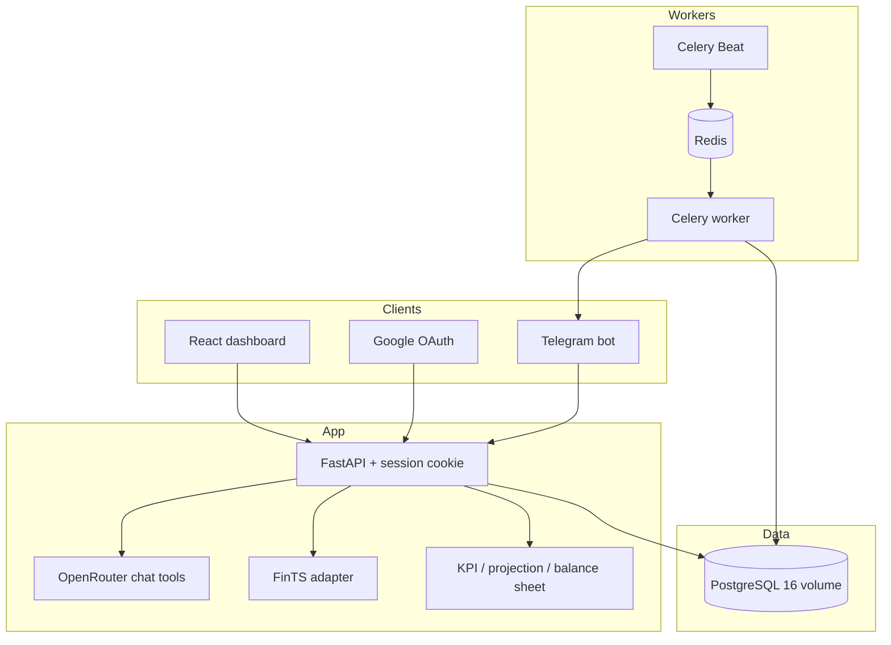

# SavingsTracker

Self-hosted household finance app: Google login, a React dashboard, FinTS bank sync (DKB and other German banks), rule-based classification, custom KPI formulas, savings projections, and an optional Telegram bot with OpenRouter chat.

Live production is typically served at `https://savings.tradercouncil.app` behind Traefik.

---

## What it does

- **Web dashboard** — Overview, chat, projections, KPIs, banking, transactions, settings. Sign in with Google. A household is one shared `users` row; invite extra emails from Settings instead of creating a second dashboard.
- **Bank sync** — Link a bank in Banking (PIN is stored encrypted). Later, **Sync** in the header, Telegram `/sync`, or chat can refresh without asking for the PIN again. DKB usually needs app approval, then **I approved it** / `/syncconfirm`.
- **Household vs personal vs depot** — Savings-rate totals use household accounts only. Mark salary accounts as personal so transfers in count as income. Mark or register a depot IBAN so giro↔depot moves become transfers, not spending.
- **Classification** — Priority-ordered rules (`contains`, `equals`, `regex`, `gt`, `lt`). You can recategorize or exclude rows in the transactions table.
- **KPIs** — Safe `asteval` formulas such as `pct(net_cashflow, total_income)`. Built-ins plus custom metrics in the KPIs tab or `/newkpi`.
- **Projections** — Compound growth with adjustable contribution, return, inflation, and horizon.
- **Telegram** — Pair from Settings (not `/start` alone). Commands plus free-text chat if an OpenRouter key is set. Monthly digest on the 1st at 08:00 Europe/Berlin via Celery Beat.

---

## Architecture (short)


```mermaid
graph TB
    subgraph "Clients"
        WEB["React dashboard"]
        TG["Telegram bot"]
        GOOG["Google OAuth"]
    end

    subgraph "App"
        API["FastAPI + session cookie"]
        LLM["OpenRouter chat tools"]
        BANK["FinTS adapter"]
        KPI["KPI / projection / balance sheet"]
    end

    subgraph "Workers"
        W["Celery worker"]
        BEAT["Celery Beat"]
        REDIS[("Redis")]
    end

    subgraph "Data"
        PG[("PostgreSQL 16 volume")]
    end

    WEB --> API
    GOOG --> API
    TG --> API
    API --> BANK & KPI & LLM
    API --> PG
    BEAT --> REDIS --> W
    W --> PG
    W --> TG
```

See [ARCHITECTURE.md](./ARCHITECTURE.md) for modules, ER diagram, and the sync pipeline.

---

## Stack

| Layer | Technology |
|:--|:--|
| API | Python 3.12, FastAPI, Starlette sessions |
| UI | React + TypeScript + Vite (baked into the Docker image) |
| Auth | Google OAuth (Authlib) |
| DB | SQLAlchemy 2 async, PostgreSQL 16, Alembic |
| Queue | Celery 5, Redis 7 |
| Bank | python-fints |
| Bot | python-telegram-bot |
| LLM | OpenRouter |

---

## Quick start (Docker)

### 1. Config

```bash
cp .env.example .env
python3 -c "from cryptography.fernet import Fernet; print(Fernet.generate_key().decode())"
```

Set at least:

```ini
DB_PASSWORD=changeme
ENCRYPTION_KEY=your-fernet-key
AUTH_SECRET_KEY=long-random-string
GOOGLE_CLIENT_ID=....apps.googleusercontent.com
GOOGLE_CLIENT_SECRET=GOCSPX-...
FINTS_PRODUCT_ID=your-registered-fints-id
```

Google OAuth Web client authorized origins / redirect URIs:

- `http://localhost:8000` and `http://localhost:8000/auth/callback` (local)
- Your public origin and `/auth/callback` in production

Optional:

- `ALLOWED_EMAILS` — signup allowlist (invites still work)
- `ADMIN_EMAILS` — who can delete other households in Settings
- `PUBLIC_BASE_URL` — e.g. `https://savings.tradercouncil.app` (OAuth callback + secure cookies)
- `OPENROUTER_API_KEY` — fallback; each household can store its own key in Settings
- `TELEGRAM_BOT_TOKEN` — fallback; each household can store its own bot token in Settings

### 2. Run

```bash
docker compose up -d --build
```

Open `http://localhost:8000` and sign in with Google.

Services: Postgres (`5432`), Redis (`6379`), app (`8000`, API + SPA + bot polling), Celery worker, Celery Beat.

Data lives in Docker volumes `pgdata` and `redisdata`. Container or VM restarts keep Postgres. `docker compose down -v` deletes it.

Swagger `/docs` is only enabled when `DEBUG=true`. APIs require a session cookie except `/api/health`, `/login`, and `/auth/callback`.

### Production (Traefik)

Use `docker-compose.prod.yml`: no published app ports, labels for `Host(\`savings.tradercouncil.app\`)`, external Docker network `proxy`, cert resolver `myresolver`. Set `PUBLIC_BASE_URL` to the HTTPS origin.

---

## Local frontend

With the API on port 8000:

```bash
cd frontend
npm ci
npm run dev
```

Vite proxies `/api`, `/login`, `/logout`, and `/auth` to `http://localhost:8000`.

---

## Telegram

1. In Settings, paste a BotFather token (or rely on `TELEGRAM_BOT_TOKEN`).
2. Tap **Connect Telegram** and open the link (or send `/start <code>`).
3. Group chats: mention the bot; add the printed chat id to `TELEGRAM_ALLOWED_CHAT_IDS`.

| Command | What it does |
|:--|:--|
| `/start` | Link with a Settings pairing code, or welcome if already linked |
| `/help` | Command list |
| `/kpis` | Household KPIs this month |
| `/newkpi` | Add a custom formula |
| `/balance` | Income vs expenses |
| `/projection` | Long-term savings projection |
| `/sync` | Start FinTS refresh (approve in the bank app if asked) |
| `/syncconfirm` | Finish sync after app approval |
| `/reset` | Clear chat history |

Free-text chat needs an OpenRouter key. There are no `/accounts` or `/connect` commands; linking the bank is in the web app.

---

## KPI formulas

Examples: `pct(net_cashflow, total_income)`, `pct(category_dining_out_total, total_expense)`, `total_expense / days_in_period`.

Variables include `total_income`, `total_expense`, `net_cashflow`, `days_in_period`, previous-period fields, and `category_<name>_total`. Full list: [docs/KPIS_AND_FORMULAS.md](./docs/KPIS_AND_FORMULAS.md).

---

## Tests

```bash
python3 -m venv .venv
source .venv/bin/activate
pip install -e ".[dev]"
pytest tests/ -q
```

---

## License

[Apache License, Version 2.0](./LICENSE).
